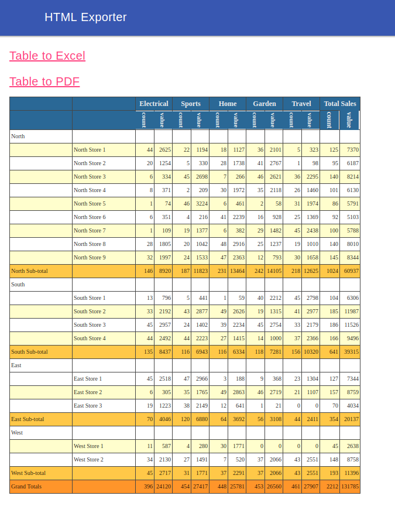
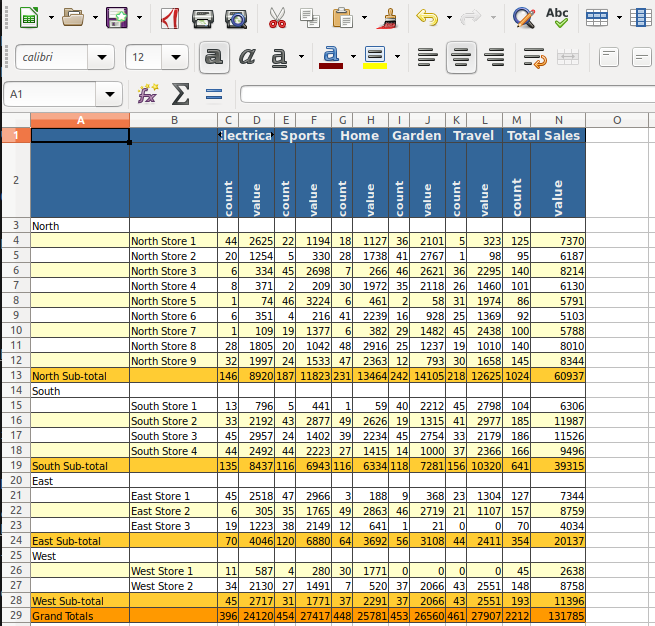
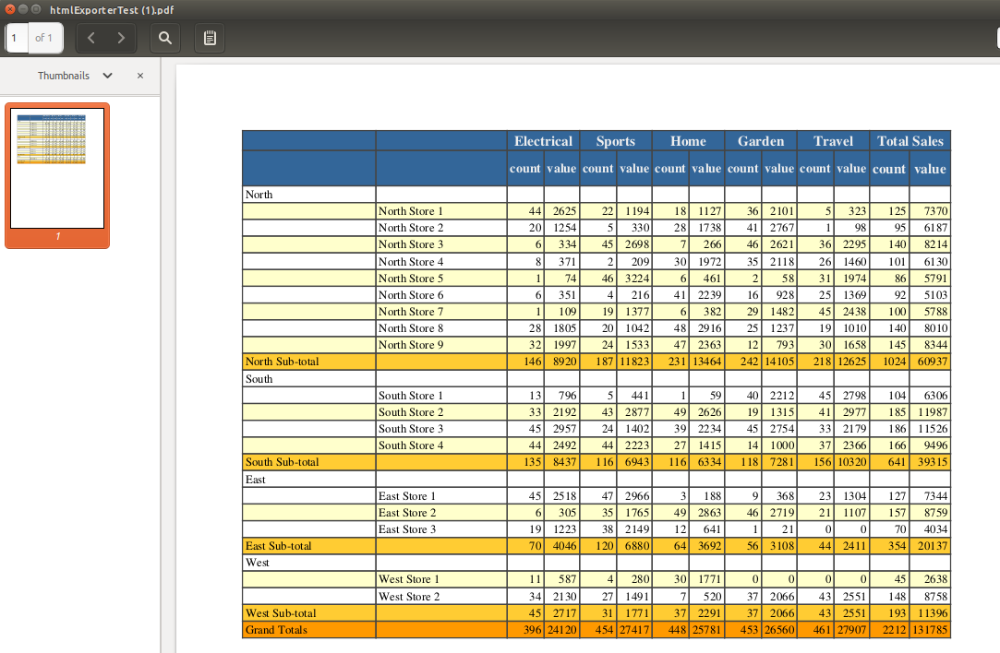

# HTML Export library

An Enonic XP library to export HTML to Excel and PDF.

The library is built on top of https://github.com/alanhay/html-exporter with some modifications.

# Usage

To install this library you need to update your build.gradle file.

# Gradle build script

## Enonic XP version >6.12

    dependencies {
        include 'openxp.lib:htmlexporter:1.0.0'
    }

## Enonic XP version <=6.11

    repositories {
        maven {
          url 'https://dl.bintray.com/openxp/enonic'
        }
    }

    dependencies {
         include 'openxp.lib:htmlexporter:1.0.0'
    }

## Examples and feature application

An example application is created to see how html can be converted to Excel and PDF. 
download url: <https://github.com/rbrastad/lib-html-exporter/raw/master/html-exporter-examples/build/libs/html_export_examples-1.0.0.jar>

Install and access the application on URL: SERVER_HOSTNAME/app/openxp.app.html.exporter.examples

The application is built for version +6.12.0

### Example: HTML to Excel and PDF controller example

    var htmlExporter = require('/lib/openxp/html-exporter');
    var ioLib = require("/lib/xp/io");

    exports.get = function(req, type) {
        var fileSource = null;

        if (type == 'pdf') {
    		fileSource = htmlToPDF();
        } else {
            fileSource = htmlToExcel();
        }
        
        // Stream the file content to the client
        return {
            body: htmlExporter.getStream(fileSource),
            headers: {
                'Content-Disposition': 'attachment; filename="' + fileSource.name + '"'
            }
        };
    };

    function htmlToExcel() {
        var fileSource = htmlExporter.exportToExcel(getHtml());
        fileSource.name = 'htmlExporterTest.xlsx';

        return fileSource;
    }

    function htmlToPDF() {
        var fileSource = htmlExporter.exportToPdf(getHtml());
        fileSource.name = 'htmlExporterTest.pdf';

        return fileSource;
    }

    function getHtml() {
        return ioLib.readText(ioLib.getResource(resolve('html-exporter-test.html')).getStream());
    }

Example HTML used can be found here: <https://github.com/rbrastad/lib-html-exporter/blob/master/html-exporter-examples/src/main/resources/controller/htmlexport/html-exporter-test.html>

## Formula in Excel
   
The Excel exporters allow for producing spreadsheets with
automatic formula insertion via the use of various HTML5 compliant
data-\* attributes being applied to table cells. The sample spreadsheets
linked to above demonstrate this functionality.

Example:

    <!-- This cell will, via the data-group attribute,  be added to two ranges, each of which will be the inputs to formulas -->
    <td data-group="store_Dumfries_2_value, region_1_1_pg_5_value" class="numeric">
        486
    </td>

    ...

    <!--
        This raw value of this cell will, via the data-group-output attribute, be replaced with a SUM function taking as input all cells added to the specified range.
        The cell is then itself added to another range which will be used by a further function.
    -->
    <td class="subTotal numeric" data-group-output="region_1_1_pg_6_count" data-group="area_1_pg_6_cou

## Screenshots

### HTML Exporter Examples APP

### Excel

### PDF 

